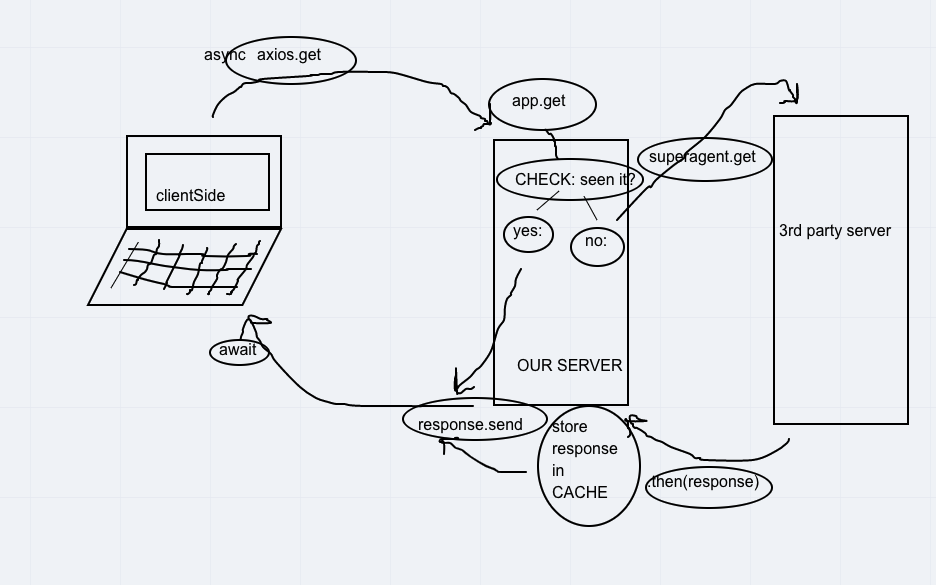

# Lab 10 - City Explorer API - 4/21/2021

**Author**: Wenhao Piao  
**Keyword**: Express, API, Cache  
**Version**: 1.0.0

This is the starter code for City Explorer API lab 10. To get started, run `npm init` and then work through the bugs inside of this code.

## Getting Started

1. Clone this repo.
2. Run `npm i` to install all required dependencies.
3. Set up environment variables.
   - Create a .env file in the root folder and setup following environment variables
   - PORT=3005
   - WEATHER_API_KEY=Your_API_KEY
4. Run `npm start` to start the server.

## Architecture

- express
- dotenv
- superagent
- cors
- nodemon (development)

## Change Log

It took me 30 minutes to fix the bugs.

## Credit and Collaborations

- Collaborator for web request-response cycle diagram - Kassie Bradshaw
- Web request-response cycle diagram
  
